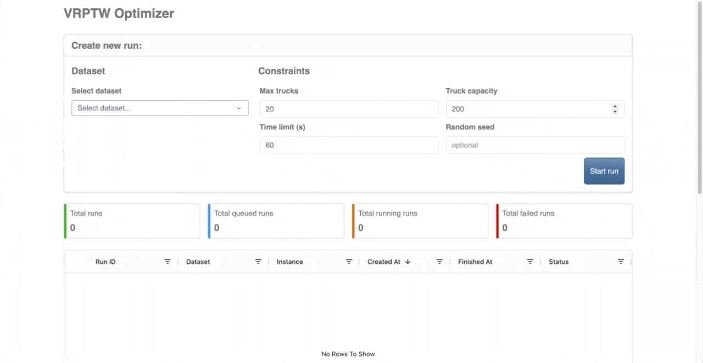
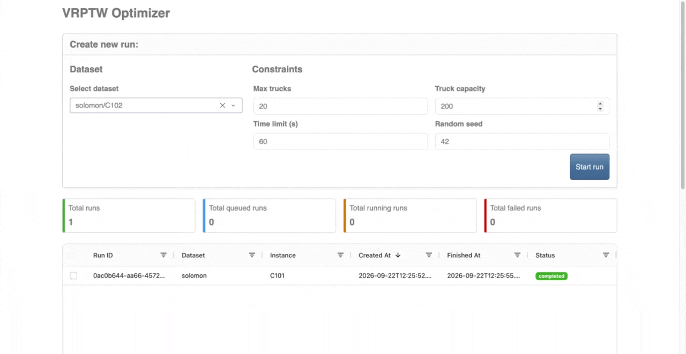
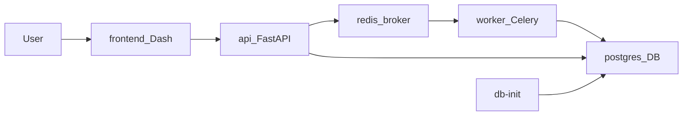

# vrptw-lab

A full-stack lab for solving and visualizing **Vehicle Routing Problems with Time Windows (VRPTW)**, powered by Google OR-Tools.


**Why this project?**

- A complete application — not just a solver script. API, background jobs, database, and dashboard work together.
- Solver runs asynchronously in the background, so the API stays responsive during long optimizations.
- Interactive route maps on classic [Solomon VRPTW benchmarks](data/README.md) (56 instances included).

## What it does

VRPTW is a classic logistics problem: you have a fleet of trucks and a set of customers. Each customer must be visited once, within their time window, without exceeding truck capacity. The goal is to use as few trucks as possible and keep total travel distance low.

### Demo


### Demo queue


This app lets you:

1. Pick a benchmark instance (for example, Solomon `C101`).
2. Submit an optimization run through the dashboard.
3. Watch the solver work in the background.
4. Explore the results — trucks used, distance, and an interactive route map.

All results are stored in PostgreSQL and available through the REST API.

For dataset details, see [data/README.md](data/README.md).

---

## Architecture



---

## Services

The full stack runs from a single [docker-compose.yaml](docker-compose.yaml) file.

| Service | What it does | Port |
|---|---|---|
| **postgres** | Stores datasets, customers, runs, and route solutions | 5432 |
| **db-init** | One-shot job: loads CSV benchmark data into Postgres on startup | — (runs once) |
| **redis** | Message broker for background solver jobs | 6379 |
| **api** | REST API — create/list runs, fetch solutions; Swagger at `/docs` | 8000 |
| **worker** | Celery worker — runs the OR-Tools CP-SAT solver | — |
| **frontend** | Plotly Dash dashboard — submit runs, view KPIs, map routes | 3000 |

`db-init` exits after ingest. The other five services stay running.

---

## Quick start

Start everything with Docker:

```bash
docker compose up --build
```

Then open:

- **Dashboard:** http://localhost:3000
- **API docs:** http://localhost:8000/docs

### Try your first run

1. Open the dashboard at http://localhost:3000.
2. In the **New run** form, pick dataset `solomon` and instance `C101`.
3. Submit the run and watch its status move from **queued** → **running** → **completed**.
4. Select the run in the table to see metrics and the route map.

To reload benchmark data after changing CSV files:

```bash
docker compose down -v && docker compose up --build
```

---

## Local development

Run infrastructure in Docker and the Python apps with [uv](https://docs.astral.sh/uv/):

**Prerequisites:** Docker, uv, Python 3.13.

The commands below deploy the services `postgres`, `redis` and `worker` using docker, adds the benchmark data using `db-init` and finally run both front and backends outside docker. This way users are able to edit the source files and directly reflect in the application without the need to rebuild the services every time.

**Option 1: local script `scripts/dev.sh`:**
```bash
bash scripts/dev.sh
```

**Option 2: commands by hand**
```bash
# 1. Start database, data ingest, broker, and worker
docker compose up postgres db-init redis worker --build -d

# 2. Start the API (terminal 1)
cd backend && uv run backend

# 3. Start the dashboard (terminal 2)
cd frontend && uv run frontend
```

| App | URL |
|---|---|
| Dashboard | http://localhost:8050 |
| API | http://localhost:8000 |
| API docs | http://localhost:8000/docs |

When running the frontend locally, set `API_BASE_URL=http://localhost:8000`.

---

## What this demonstrates

- **Decoupled solver** — optimization logic lives in its own module, separate from the API and database ([backend/src/api/optimizer/](backend/src/api/optimizer/)).
- **Async jobs** — long solver runs execute in a Celery worker via Redis, not in the HTTP request.
- **Structured persistence** — results live in normalized PostgreSQL tables, not opaque JSON blobs.
- **Read-only dashboard** — the UI consumes the REST API; it does not run the solver itself.
- **One-command deployment** — the full stack starts from a single Docker Compose file.

---

## Project layout

```
vrptw-lab/
├── backend/     # FastAPI + OR-Tools + Celery
├── frontend/    # Dash dashboard
├── db_init/     # Schema + CSV ingest
├── data/        # Solomon benchmark CSVs
└── docs/        # Project plan
```

---

## Other docs

- [Backend details](backend/README.md) — API endpoints, solver, and worker
- [Frontend details](frontend/README.md) — dashboard features and configuration
- [Data format](data/README.md) — CSV schema and directory layout
